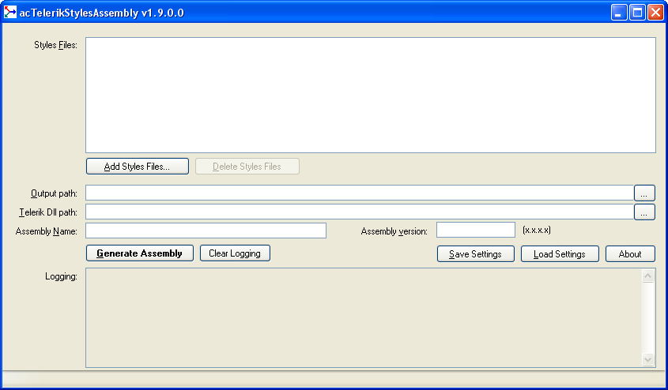

# acTelerikStylesAssembly
C# Application to generate an assembly of Telerik Skins from several CSS Telerik zipped files created by [Telerik StyleBuilder web application](http://stylebuilder.telerik.com), by [acTelerikStylesRenaming](https://github.com/acDevSoftware/acTelerikStylesRenaming) or manually.

acTelerikStylesAssembly<br>
Copyright 2015 acDevSoftware

Useful links:
- [acTelerikStylesAssembly product](https://www.acdevsoftware.ch/Tools/acTelerikStylesAssembly/).
- [acTelerikStylesAssembly Windows installer](https://www.acdevsoftware.ch/Download/Default.aspx#TOOLS).

Follow us:
- on [LinkedIn](http://www.linkedin.com/company/acdevsoftware).
- on [Facebook](https://www.facebook.com/pages/Acdevsoftware/1375578242656685).
- on [Twitter](https://twitter.com/acdevsoftware).

## License

acTelerikStylesAssembly licensing given in [License](LICENSE).

## Screenshot



## Table of contents:

1. Dependencies.
2. Before launching acTelerikStylesAssembly.
3. Usage with GUI version of acTelerikStylesAssembly.
4. Usage with console version of acTelerikStylesAssembly.
5. How to add the created Telerik Skins assembly in your ASP.NET web application/web site?
6. How to create a Telerik Skins assembly named Test.dll containing 3 different skins, with a default one.
7. How to create a zipped Telerik skin used by acTelerikStylesAssembly based on Telerik Black skin.
8. Important information about Telerik.Web.UI.dll.
9. Troubleshooting.
10. History.

### 1) Dependencies

acTelerikStylesAssembly needs:
- The Telerik.Web.UI.dll assembly, installed with a Telerik product.<br>
  Version taken in account for controls: 2017.2.228.
- Framework .NET 4.x.
- Visual Studio 2010 or newer for compiling the source code.

### 2) Before launching acTelerikStylesAssembly

Before launching acTelerikStylesAssembly, it is necessary to indicate the full path of the Telerik.Web.UI.dll assembly.

Note:
- GUI Version 1.4 and newer of acTelerikStylesAssembly lets you to enter directly the path of Telerik.Web.UI.dll assembly in the main window, field "Telerik Dll Path".
- Console version 1.9 and newer of acTelerikStylesAssembly lets you to enter the path of Telerik.Web.UI.dll assembly with argument /T.

Path of Telerik.Web.UI.dll assembly:
- This path can ben given in the acTelerikStylesAssembly.exe.config file, in the value of the key "TelerikWebUIPath":
```xml
<?xml version="1.0" encoding="utf-8" ?>
<configuration>
    <appSettings>
      <add key="TelerikWebUIPath" value=""/>
    </appSettings>
</configuration>
```
- It can also be set in a acTelerikStylesAssembly.xml settings file, under the node "TelerikWebUIPath":
```xml
<?xml version="1.0" encoding="utf-8"?>
<Settings>
    <TelerikWebUIPath></TelerikWebUIPath>
</Settings>
```
- Last possibility is to put the Telerik.Web.UI.dll file in the same folder that acTelerikStylesAssembly executable file.

### 3) Usage with GUI version of acTelerikStylesAssembly

1. Create several zipped skin files manually, by acTelerikStylesRenaming (see paragraph 7) or by [StyleBuilder Telerik Application](http://stylebuilder.telerik.com). One of them must have the same name that the name of the Telerik Skins assembly to create (without .zip) and must contains all Telerik controls.
2. After launching acTelerikStylesAssembly from a Windows Explorer, click on the button "Add Styles Files...", and add all zipped skin files created in point 1.
3. Set an output directory for the Telerik Skins assembly to create.
4. Set the path of the Telerik Dll assembly (Telerik.Web.UI.dll); optional, see paragraph 2).
5. Set a name without dll extension for the Telerik Skins assembly to create (name must be one of the zipped skin filename without .zip); Name example: MyBlack.
6. Set a version for the Telerik Skins assembly to create.
7. Click on the button "Generate Assembly" and if no error occurs, the Telerik Skins assembly is created in the Output Directory.


### 4) Usage with console version of acTelerikStylesAssembly (experimental)

1. Create several zipped skin files manually, by acTelerikStylesRenaming (see paragraph 7) or by [StyleBuilder Telerik Application](http://stylebuilder.telerik.com). One of them must have the same name that the name of the Telerik Skins assembly to create (without .zip) and must contains all Telerik controls.
2. Launch acTelerikStylesAssembly from a console by giving the necessary uppercase arguments with joined values, no space between argument and its value (/H for help):<br>
   &emsp;/X : The path name of a Xml settings file, override all other command line arguments<br>
   &emsp;/A : The name of the assembly to generate, without dll extension<br>
   &emsp;/R : The version of the assembly to generate [x.x.x.x]<br>
   &emsp;/S : The path name of a zipped Telerik skin file (repetitive argument)<br>
   &emsp;/O : The directory name where to save the generated assembly<br>
   &emsp;/T : The directory name where to find the Telerik.Web.UI.dll (optional)<br>
   &emsp;/V : Verbose log, no log output except error and help  (optional)<br>
   By example 1:<br>
   &emsp;acTelerikStylesAssembly /AMyAssembly /R12.1.1.1 /S"C:\My SecondTest\Test.zip" /SC:\MyTest /O"C:\My Test" /V<br>
   By Example 2:<br>
   &emsp;acTelerikStylesAssembly /X"C:\My SecondTest\acTelerikStylesAssembly.xml"


### 5) How to add the created Telerik Skins assembly in your ASP.NET web application/web site?

1. The version of Telerik.Web.UI.dll assembly used in your ASP.NET web application/web site must be the same that the one used for acTelerikStylesAssembly in paragraph 2.
2. In the web.config, under the node configuration/appSettings, add the following keys:
   - Telerik.Web.SkinsAssembly: Name of the created Telerik Skins assembly (see C.5 or D.2 /A)
   - Telerik.EnableEmbeddedSkins: True
   - Telerik.Skin: Name of the created Telerik Skins assembly (see C.5 or D.2 /A), to be used as
     default skin for all Telerik controls.<br><br>
Example with MyBlack Telerik Skin Dll:
```xml
<?xml version="1.0"?>
<configuration>
  <appSettings>
    <add key="Telerik.Web.SkinsAssembly" value="MyBlack" />
    <add key="Telerik.EnableEmbeddedSkins" value="true" />
    <add key="Telerik.Skin" value="MyBlack" />
  </appSettings>
</configuration>
```
3. To use other skins containing in your created Telerik Skins assembly, add in the main page or master page of your web application/web site the Telerik control &lt;telerik:RadSkinManager&gt;.<br><br>
Example:
```xml
<telerik:RadSkinManager ID="RadSkinManager1" runat="server">
  <TargetControls>
    <telerik:TargetControl ControlID="RadGrid" Skin="Name of other skin" />
    <telerik:TargetControl ControlID="RadComboBox" Skin="Name of other skin" />                     
  </TargetControls>
</telerik:RadSkinManager>
```

### 6) How to create a Telerik Skins assembly named Test.dll containing 3 different skins, with a default one.

1. The "Test" folder contains 3 zipped skin files created by StyleBuilder Telerik Application (version 28.03.2013, Telerik.Web.UI.dll: 2013.1.411):
   - Test.zip: contains all controls styles (skin: Office2010Silver)
   - Test_Ext1.zip: contains custom styles for RadGrid (skin: Office2010Blue)
   - Test_Ext2.zip: contains custom styles for RadComboBox (skin: Office2010Black)
2. Open acTelerikStylesAssembly and click the button "Load Settings".
3. In the Open Dialog, go to in "Test" folder and open acTelerikStylesAssembly.xml.
4. The acTelerikStylesAssembly application is set with all "Test" skins information.
5. Fill the "Telerik Dll Path" field with the path to the file "Telerik.Web.UI.dll".
6. Click the button "Generate Assembly" to create Test.dll
7. In your ASP.NET web application/web site web.config file:
```xml
<?xml version="1.0"?>
<configuration>
  <appSettings>
    <add key="Telerik.Web.SkinsAssembly" value="Test" />
    <add key="Telerik.EnableEmbeddedSkins" value="true" />
    <add key="Telerik.Skin" value="Test" />
  </appSettings>
</configuration>
```
8. In your main or master page, to use other skins Test_Ext1 and Test_Ext2:
```xml
<telerik:RadSkinManager ID="RadSkinManager1" runat="server">
  <TargetControls>
    <telerik:TargetControl ControlID="RadGrid" Skin="Test_Ext1" />
    <telerik:TargetControl ControlID="RadComboBox" Skin="Test_Ext2" />                     
  </TargetControls>
</telerik:RadSkinManager>
```

### 7) How to create a zipped Telerik skin file used by acTelerikStylesAssembly based on Telerik Black skin

By acTelerikStylesRenaming:
1. Follow the paragraph 3 of the acTelerikStylesRenaming README file.

Manually:
1. Create a folder with the name of your new Skin, by example MySkin
2. Go to the installed folder of "RadControls for ASP.NET AJAX" and open the folder Skins.
3. Copy the content of the folder Black into your folder MySkin.
4. Copy the content of the folder Common into your folder MySkin/Common.<br>
   (depending of the skin, not all files are necessary).
5. Rename all CSS files by changing the word Black to MySkin.
6. In each CSS file, replace all occurences of Black by MySkin and save it.
7. Do your custom changes in CSS and image files.
8. Zip the content of the folder MySkin, and name it MySkin.zip.<br>
   (the MySkin.zip tree must not content MySkin folder at the root, but directly files and folders of it)


### 8) Important information about Telerik.Web.UI.dll.

Until version 2014.3.1209 included, some references to skin files are hardcoded in Telerik.Web.UI.dll and don't depend of the appSetting "Telerik.Web.SkinsAssembly".<br>
The result is when you use a custom Skin Assembly and a Telerik control uses these hardcoded references on files, these files are not displayed because Telerik.Web.UI.dll is searching a file for a control as "Telerik.Web.UI.Skins.<Skin Name>.<Control>.<Resource filename>" and not as expected "<Skin Assembly Name>.<Skin Name>.<Control>.<Resource filename>. Hopefully, there are only few hardcoded references:

- RadGrid: Only the column GridEditCommandColumn ButtonType="ImageButton" gives a invalid references on files for Edit.gif, Update.gif, Cancel.gif.
- RadDataPager: Images of SEO buttons, like PagingFirst.gif, etc.

As workarounds:
- Name your Skin Assembly "Telerik.Web.UI.Skins" and replace the Telerik one by yours in your project.
- For RadGrid, use the ImagesPath property to give a path for the image files like Edit.gif, etc. (workaround given by Samuel Chou).

The problem has been reported to Telerik under the TeamPulse issue:
http://feedback.telerik.com/Project/108/Feedback/Details/51198-fix-when-using-custom-skins-assembly-to-change-hardcoded-telerik-web-ui-skins-d

### 9) Troubleshooting

Some skins files, like Map.Office2010Silver.css, contain, at beginning of the file, some comments:
```CSS
/*$main-sprite: skin-image-url( "Common", "radActionsSprite.png" );
$main-spriteIE6: skin-image-url( "Common", "radActionsSpriteIE6.png" );*/
```

Before v1.9, acTelerikStylesAssembly didn't know how to handle these comments and raised an error when it processed the files containing them. So please remove these comments of the files in error and acTelerikStylesAssembly v1.8 and earlier versions will handle them correctly.

### 10) History

1.1.1:

Initial release

1.1.2:

Fix:
- Some Telerik base skins have file references like "../Common/..." that were not taken in account. Now, acTelerikStylesAssembly changes "../Common..." to "Common/..".<br>
  (this problem occurs only if Style Builder Telerik Application is not used to create
   zipped skin files, ie by "hands")

New:
- Added the possibility to load the Telerik.Web.UI.dll with a UNC path.
- Added the property "AssemblyCulture" in acTelerikStylesAssembly.exe.config to set the culture of the generated skins assembly (example: en, fr-FR). If empty, no culture is set.

1.2:

New:
- Added the Telerik RadAutoCompleteBox, RadChart, RadHtmlChart and RadPivotGrid controls.
- Added the F section to describe how to create a zipped Telerik skin manually to be used by acTelerikStylesAssembly.

1.3:

New:
- Added the Telerik RadDropDownList, RadDropDownTree, RadSearchBox controls, version 2013.1.403.

1.4 (19.04.2013):

New:
- Added lastest version of Telerik.Web.UI.dll, 2013.1.417, taken in account.
- Added in Main Window the optional field "Telerik Dll Path" that can be filled with the path of the "Telerik.Web.UI.dll" used by acTelerikStylesAssembly. This field is saved in the acTelerikStylesAssembly.xml file by the button "Save Settings".

Fix:
- The "../Common/..." path was not correctly handled if sub folders were included in the path, like "../Common/Grid/...".
- The loading from Application folder of "Telerik.Web.UI.dll" was not correctly handled if an empty <TelerikWebUIPath> was given in acTelerikStylesAssembly.exe.config or acTelerikStylesAssembly.xml file (reported by Samuel Chou).

1.5 (17.06.2013):

New:
- Added lastest version of Telerik.Web.UI.dll, 2013.2.611, taken in account.
- Added the Telerik RadTileList control.
- Added mime types for file.cur and file.ico: image/x-icon.

Fix:
- Test/Test.zip, Test/Test_Ext1.zip and Test/Test_Ext2.zip have been generated with lasted Telerik StyleBuilder application: 28.03.2013 (Telerik.Web.UI.dll: 2013.1.411).
- The value of field "Telerik Dll Path" is directly taken in account when an assembly is generated, without saving into the config xml file.

1.6 (21.10.2013):

New:
- Added lastest version of Telerik.Web.UI.dll, 2013.3.1015, taken in account.
- Added the Telerik RadCloudUpload, RadLightBox, RadMediaPlayer controls.
- Added Clear Logging button to clear all log texts.

Fix:
- Change RadProgressArea base control from RadUpload to RadProgressArea.
- Add RadBaseTile control.
- Add RadLinearGauge, RadRadialGauge controls (these controls don't have any .css files, for future use).

1.7 (21.06.2014):

New:
- Added lastest version of Telerik.Web.UI.dll, 2014.2.618, taken in account.
- Added the RadDiagram, RadGantt, RadImageGallery, RadMap and RadPageLayout controls.

1.8 (07.04.2015):

New:
- Use Telerik.Web.UI.dll, 2014.3.1209.
- Added the RadDataForm, RadUploadProgressArea, RadTreeMap and RadWizard controls.

1.9 (22.05.2015):

New:
- acTelerikStylesAssembly can be used from console with arguments (see /? for help). Ideal for MSBuild and other identical tools (idea from Christopher Cassidy). Experimental

Fix:
- Minor changes in code.
- Some skins files, like Map.Office2010Silver.css, contain at beginning of the file some comments:
```CSS
     /*$main-sprite: skin-image-url( "Common", "radActionsSprite.png" );
     $main-spriteIE6: skin-image-url( "Common", "radActionsSpriteIE6.png" );*/
```
  No error occurs anymore when they are parsed.
